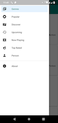

# MovieDB

[Download APK](https://github.com/fahimshahrierrasel/moviedb/releases/download/v1.0/MovieDB_debug.apk)

#### Dependencies
* Logger
* RXJava2, RXAndroid and RXKotlin
* Retrofit 2, GSON
* Glide
* MaterialDrawer
* BRVAH (Base RecyclerView Adapter Helper)
* MultiSlider

#### Screenshots
##### Drawer, Genre and Movie List
   
##### Movie Search and Details
 
##### Actor and Details
 
